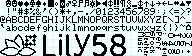

# QMK-HID-Display

A small node script that will collect data and send updates to a qmk enabled keyboard to show on the OLED display.

## Pre-requisites
* To use this script you must have a QMK enabled keyboard with OLED displays such as the Lily58.
* You also need to have flashed the keyboard with custom QMK firmware that has the corresponding OLED update code
* The update code can be found on my qmk_firmware fork in the lily58 branch.
    * Specifically this commit - [3ae097783d65e71062606906f7b4be639d9d321d](https://github.com/BlankSourceCode/qmk_firmware/commit/3ae097783d65e71062606906f7b4be639d9d321d
    "qmk_firmware oled update code")
* You will also need to have copied over my custom font from this repo
    * This font can  be found in the qmk_firmware fork here: [glcdfont.c](https://github.com/BlankSourceCode/qmk_firmware/blob/lily58/keyboards/lily58/keymaps/blanksourcecode/glcdfont.c "font firmware file")

## Development Setup
* Clone this repo
* Run `npm install` in '/qmk-hid-display'
* Plug in your QMK enabled keyboard that has the custom firmware (linked above)
* Open '/qmk-hid-display' in `VS Code`
* Press `F5` to start debugging

## Using the script
* Clone this repo
* Run `npm install` in '/qmk-hid-display'
* Plug in your QMK enabled keyboard that has the custom firmware (linked above)
* Run `npm run start`

## How it works
* The script simply calls various node api/packages to collect data that we want to use for the display on the keyboard oled screen
* The examples included are:
    * Perf - shows stats for cpu, memory usage (mem), disk activity (dsk), and network bandwidth use (net). As a little bar graph. It's going crazy because my PC is pretty old and I just started downloading some blizzard game update.
    * Stock - shows current stock price of 4 tech stocks I added, MSFT, AAPL, GOOG, and FB.
    * Weather - shows current weather forecast for the Seattle area.
* But essentially you can use anything that fits into the 21x4 character screen and is available in the font image
* Once per second, the script sends over the screen data to the keyboard one line at a time which is then sent to the slave oled on the keyboard
* The keyboard can also send data back to the script to indicate which data it would like to show.
* Data must be sent in the form of an 84 (21*4) length byte array, where each byte corresponds to an index in the font image
   * Warning - I don't know that there is sufficient array length checks in the example firmware, so do be sure not to send the wrong amount of data
* The keyboard already takes care of mapping normal ascii chars to the font data index, so you can just convert an 84 length string into char codes (using `charCodeAt`) and send that.
* The script does some slightly fancy stuff to map to different parts of the font image where I've drawn sideways titles so that it reads correctly on the oled (but those can only be 4 spaces long due to the orientation of the oled displays)
* Since all the processing is done in the script and the keyboard just displays whatever you send, you don't need to re-flash the firmware at all
* This means you could do fancy effects like scrolling the text if it was too long by just sending a different string in each update (see the `startWeatherMonitor()`)

To anyone brave enough to use this - Good Luck!
